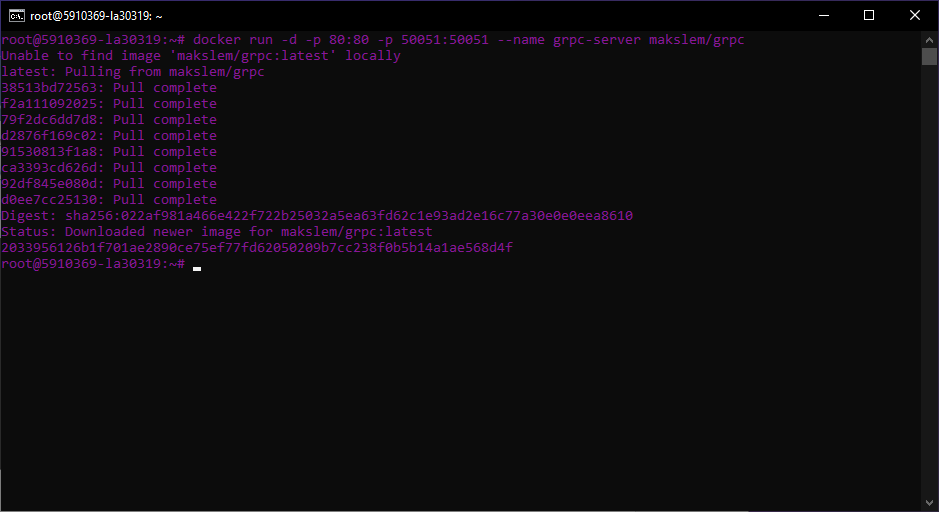
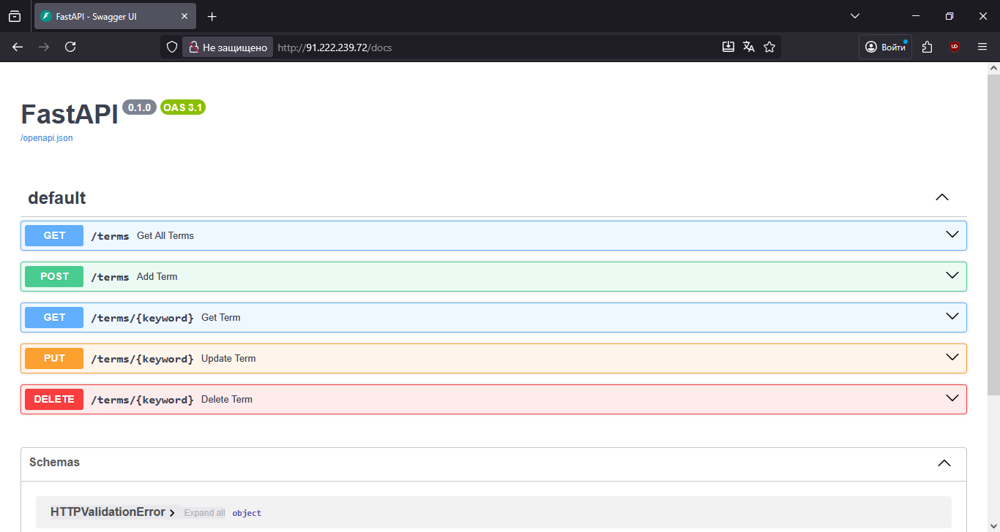
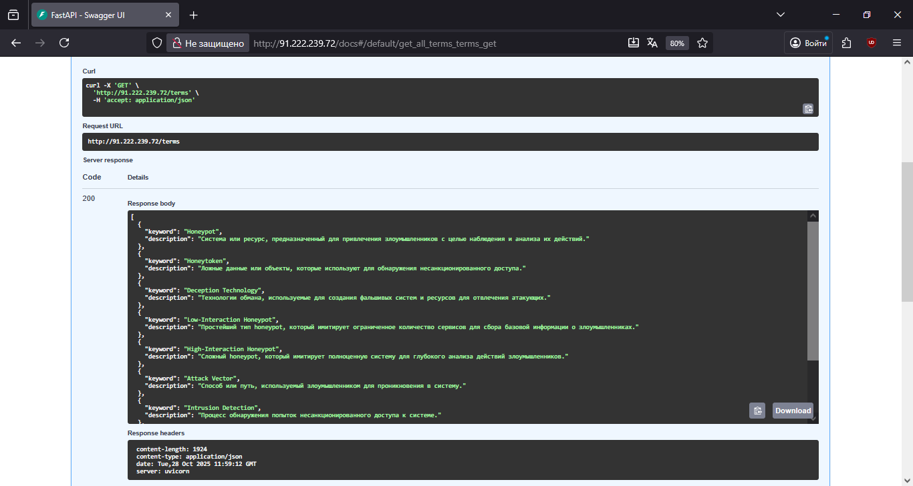
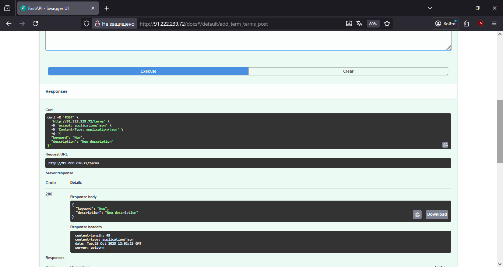
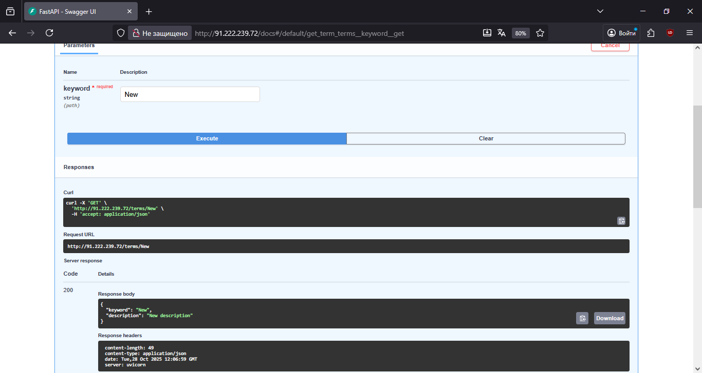
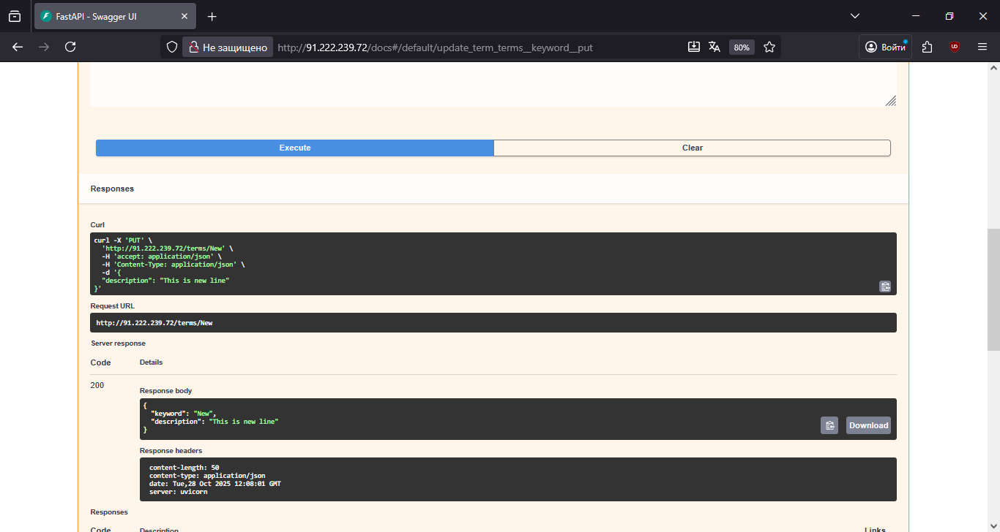
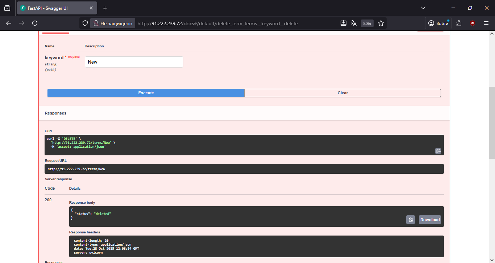

# Лабораторная работа №4. RPC. gRPC. Protobuf.

### 1. Загружаем и запускаем контейнер на публичном сервере

### 2. Подключаемся к API на публичном сервере

### 3. Демонстрация получения данных из базы

### 4. Демонстрация добавления нового термина

### 5. Демонстрация получения термина по ключу

### 6. Демонстрация изменения термина

### 7. Демонстрация удаления термина

